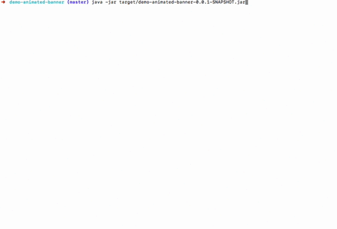

[[v2.0]]
= 重大变更
include::authors.adoc[]
v{spring-boot-version}
include::attributes.adoc[]

:actuator-api-docs: https://docs.spring.io/spring-boot/docs/2.0.x/actuator-api/html/
:docs: https://docs.spring.io/spring-boot/docs/2.0.x/reference/htmlsingle/

== 环境

- jdk
* [*] jdk8, jdk9
* [ ] jdk8-

- gradle
* [x] gradle 4.x

== 第三方库
Spring Boot 2.0 开始使用 `Spring Framework 5` 。阅读 `Spring Framework 5.0` 参阅 https://github.com/spring-projects/spring-framework/wiki/What%27s-New-in-Spring-Framework-5.x[spring5新特性],以及 https://github.com/spring-projects/spring-framework/wiki/Upgrading-to-Spring-Framework-5.x[spring5迁移指南]。

=== 重要的第三方库更新
- Tomcat 8.5
- Flyway 5
- Hibernate 5.2
- Thymeleaf 3

=== 新特性

|===
|模块 | 备注

|Reactive Spring | `Spring WebFlux & WebFlux.fn`, `Reactive Spring Data`, `Reactive Spring Security`
|内置型 Netty Server | 由于 `WebFlux` 不依赖于 `Servlet API`，首次能够支持 `Netty` 作为嵌入式服务器。 spring-boot-starter-webflux 启动器 POM 将引入 `Netty 4.1` 和 `Ractor Netty`。
|HTTP/2 Support | 为 `Tomcat`、`Undertow` 和 `Jetty` 提供了 `HTTP/2` 支持。支持取决于所选的 Web 服务器和应用程序环境（因为 JDK 8 不支持开箱即用的协议）
|===

== 外部自动配置
用于将 `Environment` 属性绑定到 `@ConfigurationProperties` 的机制已在 Spring Boot 2.0 中彻底改革。收紧了管理宽松绑定的规则，并修复了 `Spring Boot 1.x` 中的许多不一致之处。

新的 Binder API 也可以在 @ConfigurationProperties 之外直接在您自己的代码中使用。例如，以下将绑定到 PersonName 对象列表：

[source,java]
----
List<PersonName> people = Binder.get(environment)
    .bind("my.property", Bindable.listOf(PersonName.class))
    .orElseThrow(IllegalStateException::new);
----

配置源可以像这样在 YAML 中表示

[source,yaml]
----
my:
  property:
  - first-name: Jane
    last-name: Doe
  - first-name: John
    last-name: Doe
----

TIP: 更多资料参阅 https://github.com/spring-projects/spring-boot/wiki/Relaxed-Binding-2.0[springboot 2.0松弛绑定更新 ]

=== converting durations
`Duration converter`允许以 `ISO-8601` 形式或简单字符串（例如， `10m` 标识 10 分钟）指定`durations`。 现在 已有属性已全部使用 `Duration`。 例如，会话超时可以在 `application.properties` 中配置为 180 秒，如下所示：

[source, properties]
----
server.servlet.session.timeout=180s
----

TIP: 更多详情请参阅: https://docs.spring.io/spring-boot/docs/2.0.x/reference/htmlsingle/#boot-features-external-config-conversion-duration[external-config-conversion-duration]

=== 分隔字符串转换 @Delimiter
分隔字符串转换允许您将简单的字符串绑定到集合或数组，而不必以逗号分隔。

例如，LDAP 的 base-dn 属性,本身还有比较多的 `,` 使用 `@Delimiter(Delimiter.NONE)` 后不会被 `,` 拆分成数组。

== Actuator 改进
Spring Boot 2.0 对 `actuator endpoints` 进行了许多改进和改进。所有 HTTP 执行器端点现在都暴露在 `/actuator` 路径下，并且结果 `JSON payload` 已得到改进。 默认情况下，现在也不公开这么多端点。如果您要升级现有的 Spring Boot 1.5 应用程序，特别注意 `management.endpoints.web.exposure.include` 属性。

=== Actuator JSON

{actuator-api-docs}[Spring Boot Actuator Web API Documentation]

=== Jersey and WebFlux Support
除了 Spring MVC 和 JMX 支持之外，您现在在开发部署 Jersey 或 WebFlux 应用程序后可以放访问 actuator endpoints。 Jersey 支持通过自定义 Jersey `Resource` 提供，WebFlux 使用自定义 `HandlerMapping`。

=== Hypermedia links
`actuator` 端点现在提供 HAL 格式的响应，提供指向所有活动 endpoints 的链接（即使您的类路径上没有 Spring HATEOAS）。

=== Actuator @Endpoints
`@Endpoint` 注释可以与 `@ReadOperation`、`@WriteOperation` 和 `@DeleteOperation` 结合使用，以与技术无关的方式开发 endpoints。

您还可以使用 `@EndpointWebExtension` 或 `@EndpointJmxExtension` 为端点编写特定的增强功能。有关详细信息，请参阅 {docs}production-ready-endpoints-custom[production-ready-endpoints-custom]。

=== Micrometer
Spring Boot 2.0 不再附带自己的 metrics APIs。
作为代替，使用 https://micrometer.io/[micrometer.io] 为所有应用提供监控支持.

Micrometer 包括对维度度量的支持，当与维度监控系统配合时，允许有效访问特定命名度量，并能够向下钻取其维度。

Metrics 可以导出到各种体系中，开箱即用的 Spring Boot 2.0 为 Atlas、Datadog、Ganglia、Graphite、Influx、JMX、New Relic、Prometheus、SignalFx、StatsD 和 Wavefront 提供支持。此外，还可以使用其他简单的内存中指标。

集成了 JVM 指标（包括 CPU、内存、线程和 GC）、Logback、Tomcat、Spring MVC 和 `RestTemplate`。

更多请参阅 {docs}#production-ready-metrics["Metrics" section]。

== 数据层

=== HikariCP
Spring Boot 2.0 中默认的数据库池技术已经从 Tomcat Pool 切换到 HikariCP。我们发现 Hakari 提供了卓越的性能。

=== Initialization
Spring Boot 2.0 对数据库初始化逻辑进行了合理化处理。 Spring Batch、Spring Integration、Spring Session 和 Quartz 的初始化现在仅在使用和嵌入数据库时默认发生。 +
`enabled` 属性已被替换为更具表现力的枚举。例如，如果您想始终执行 Spring Batch 初始化，则可以设置 `spring.batch.initialize-schema=always`。

如果 Flyway 或 Liquibase 正在管理您的数据源的架构并且您使用的是嵌入式数据库，则 Spring Boot 现在将自动关闭 Hibernate 的自动 DDL 功能。

=== JOOQ
Spring Boot 2.0 现在根据数据源自动检测 jOOQ 方言（类似于为 JPA 方言所做的）。还引入了新的 `@JooqTest` 注释，以简化只需要使用 jOOQ 的测试。

=== JdbcTemplate
Spring Boot 自动配置的 `JdbcTemplate` 现在可以通过 `spring.jdbc.template` 属性进行自定义。此外，自动配置的“NamedParameterJdbcTemplate”在幕后重用了“JdbcTemplate”。

=== Spring Data Web Configuration
Spring Boot 公开了一个新的 `spring.data.web` 配置命名空间，允许轻松配置分页和排序。

可以在 `application.properties` 中对 Pageable 对象进行自定义
[source]
----
## 是否显示 SQL 语句
spring.jpa.show-sql=true

## DATA WEB 相关配置 {@link SpringDataWebProperties}
## 分页大小 默认为 20
spring.data.web.pageable.default-page-size=3
## 当前页参数名 默认为 page
spring.data.web.pageable.page-parameter=pageNumber
## 当前页参数名 默认为 size
spring.data.web.pageable.size-parameter=pageSize
## 字段排序参数名 默认为 sort
spring.data.web.sort.sort-parameter=orderBy
----

=== Influx DB
Spring Boot 新增 开源时间序列数据库 InfluxDB的自动配置。要启用 InfluxDB 支持，您需要设置一个 `spring.influx.url` 属性，并在 classpath 中包含 `influxdb-java`。

=== Flyway/Liquibase 灵活配置
如果只提供自定义的 `url` 或 `user` 属性，Flyway 和 Liquibase 的自动配置现在会使用这些配置而不是忽略它们。
这允许您创建一个自定义的“DataSource”，以便在使用所需的信息时进行迁移。

=== Hibernate
现在支持自定义 Hibernate 命名策略。对于高级场景，您现在可以定义 `ImplicitNamingStrategy` 或 `PhysicalNamingStrategy` 以在上下文中用作常规 bean。

现在还可以通过公开一个 `HibernatePropertiesCustomizer` bean 以更细粒度的方式自定义 Hibernate 使用的属性。

=== MongoDB Client Customization
使用reactive driver时，现在可以通过定义类型为 `MongoClientSettingsBuilderCustomizer` 的 bean 将高级自定义应用于 Spring Boot 自动配置的 Mongo 客户端。

=== Redis
现在可以使用 `spring.cache.redis.` 属性配置 Redis 的缓存默认值。

== Web
除了上面提到的 WebFlux 和 WebFlux.fn 支持之外，还进行了以下改进以帮助开发 Web 应用程序。

=== Context Path Logging
使用嵌入式容器时，上下文路径会在应用程序启动时与 HTTP 端口一起打印日志。 +
例如， 嵌入式 Tomcat 现在看起来像这样：

[source, console]
----
Tomcat started on port(s): 8080 (http) with context path '/foo'
----

=== Web Filter Initialization
Web filters 现在在所有支持的容器上快速地初始化.

=== Thymeleaf
Thymeleaf starter 现在包含 `thymeleaf-extras-java8time`，它提供对 `javax.time` 类型的支持。

=== JSON Support
一个新的 `spring-boot-starter-json` 启动器收集必要的位来读取和写入 JSON。它不仅提供了 `jackson-databind`，还提供了使用 Java8 时有用的模块：`jackson-datatype-jdk8`、`jackson-datatype-jsr310` 和 `jackson-module-parameter-names`。 +
这个新的 starter 现在用于之前定义了 `jackson-databind` 的地方。 +
如果你更喜欢 Jackson 以外的东西，在 Spring Boot 2.0 中对 GSON 的支持已经大大改进。还引入了对 JSON-B 的支持（包括 JSON-B 测试支持）。

== Quartz
增加对 Quartz Scheduler 的自动装配置支持， https://www.quartz-scheduler.org/[Quartz Scheduler]. +
添加了一个新的 `spring-boot-starter-quartz` 启动器 POM。

您可以使用内存型的“JobStores”，或完整的基于 JDBC 的存储。 Spring 应用程序上下文中的所有 `JobDetail`、`Calendar` 和 `Trigger` bean 都将自动注册到 `Scheduler`。

有关更多详细信息，请阅读参考文档的新 {docs}boot-features-quartz["Quartz Scheduler" section]。

== Testing
对 Spring Boot 2.0 中提供的测试支持进行了一些添加和调整：

* 添加了新的 `@WebFluxTest` 注释以支持 WebFlux 应用程序的“`slice`”测试。
* `Converter` 和 `GenericConverter` bean 现在可以使用 `@WebMvcTest` 和 `@WebFluxTest` 自动扫描。
* 添加了一个 `@AutoConfigureWebTestClient` 注释以提供一个 `WebTestClient` bean 供测试使用。
注释会自动应用于 `@WebFluxTest` 测试。
* 添加了一个新的“ApplicationContextRunner”测试实用程序，可以非常轻松地测试您的自动配置。
我们已将大部分内部测试套件移至此新模型。有关详细信息，请参阅 {docs}boot-features-test-autoconfig[更新的文档]。

== 其它乱七八糟的
除了上面列出的更改外，还有许多小的调整和改进，包括：

* `@ConditionalOnBean` 现在在确定是否满足条件时使用逻辑“AND”而不是逻辑“OR”。
* Unconditional classes 现在包含在自动配置报告中.
* `spring` CLI 应用程序现在包含一个 `encodepassword` 命令，可用于创建与 Spring Security 兼容的散列密码.
* 可以使用“scheduledtasks” 在 actuator endpoint查看计划任务（即“@EnableScheduling”）.
*  `loggers` actuator endpoint 现在允许您将记录器级别重置为其默认值。
* Spring Session 用户现在可以通过 `sessions` actuator endpoint 查找和删除会话。
* 使用 `spring-boot-starter-parent` 的基于 Maven 的应用程序现在默认使用 `-parameters` 标志。
* 我们的构建现在使用 https://concourse-ci.org[concourse] 作为 CI 并且我们的项目 POM 文件已经重组，因此它们更简单（这些更改应该对大多数用户透明，但如果您发现已发布的 POM 有任何问题，请 https://github.comspring-projectsspring-bootissues[反馈问题给我们])。

== Spring boot 2.0 configuration changelog

TIP: Check <<Spring-Boot-2.0-Configuration-Changelog#v2.0-configuration-changelog, 2.0-configuration-changelog>> for a complete overview of the changes in configuration.

== Animated ASCII Art
Spring Boot 2.0 现在支持动画 GIF banner.
demo  https://github.com/snicoll-demos/demo-animated-banner[gif demo]

